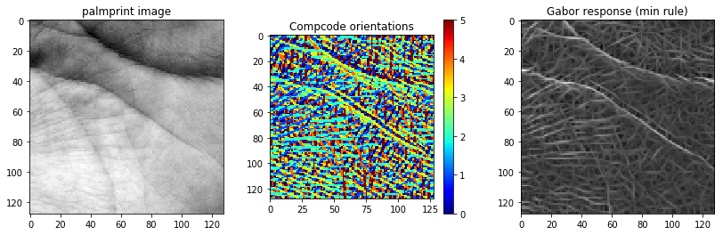
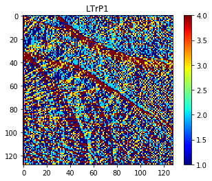
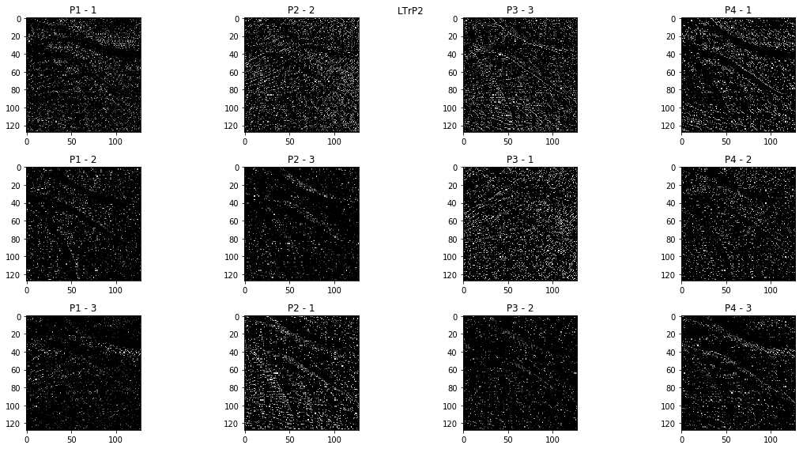
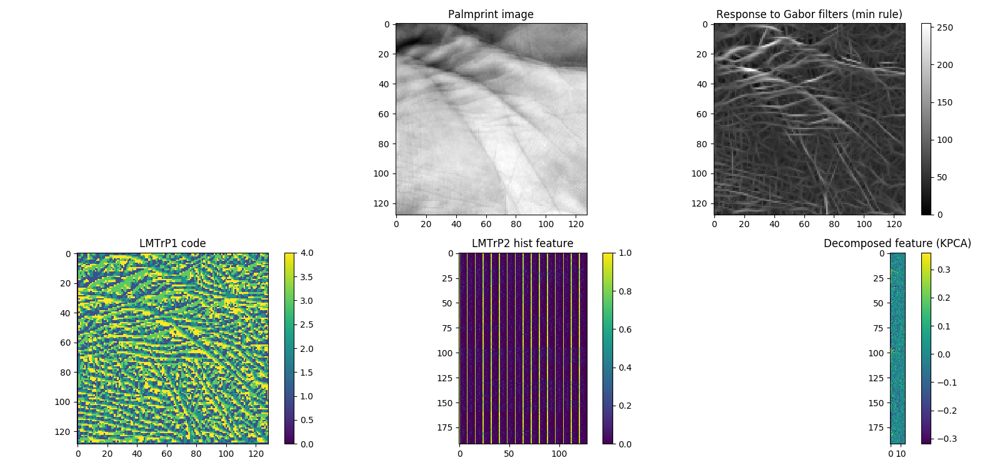
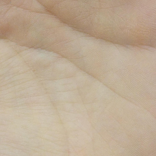

# palmprint-feature-extraction-techniques
Various palmprint feature extraction techniques implemented in Python 2.7 (and OpenCV), as part of my PhD work...

## Required libraries:
1. OpenCV (I used 3.4.2)
2. Numpy
3. Scipy
4. Scikit-learn
5. Scikit-image

## Implemented:
1. Competitive Coding Scheme (CompCode)
2. Robust Line Orientation Code (RLOC)
3. Local Tetra Pattern (LTrP)
4. Local Micro-structure Tetra Pattern (LMTrP)

## Details:
## 1. Competitive Coding Scheme (CompCode) \[1] -> used for Palmprint feature extraction

## 2. Robust Line Orientation Code (RLOC) \[2] -> used for Palmprint feature extraction
[article](https://www.sciencedirect.com/science/article/pii/S0031320307004530)

## 3. Local Tetra Pattern (LTrP)  \[3] -> used for Image Indexing

**The implementation can be found in 'LTrP_LMTrP_implementation/LTrP_and_LMTrP_v1.ipynb'**

## 4. Local Micro-structure Tetra Pattern  \[4] -> used for Palmprint recognition

**The implementation can be found in 'LTrP_LMTrP_implementation/LTrP_and_LMTrP_v1.ipynb'**

## Sample palmprint image: *LTrP_LMTrP_implementation/001MBL_G4_S1_C.png*

# References
\[1] A. W. -. Kong and D. Zhang, "Competitive coding scheme for palmprint verification," Proceedings of the 17th International Conference on Pattern Recognition, 2004. ICPR 2004., Cambridge, 2004, pp. 520-523 Vol.1. doi: 10.1109/ICPR.2004.1334184. [IEEE-Xplore link](https://ieeexplore.ieee.org/document/1334184)

\[2] S. Murala, R. P. Maheshwari and R. Balasubramanian, "Local Tetra Patterns: A New Feature Descriptor for Content-Based Image Retrieval," in IEEE Transactions on Image Processing, vol. 21, no. 5, pp. 2874-2886, May 2012.
doi: 10.1109/TIP.2012.2188809. [IEEE-Xplore link](https://ieeexplore.ieee.org/abstract/document/6175124)

\[3] Gen Li, Jaihie Kim, "Palmprint recognition with Local Micro-structure Tetra Pattern" in Pattern Recognition, Volume 61, 2017,Pages 29-46, doi: 10.1016/j.patcog.2016.06.025. [Science Direct link](http://www.sciencedirect.com/science/article/pii/S003132031630142X)

